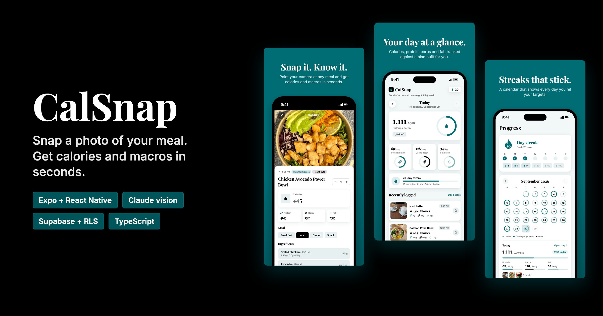
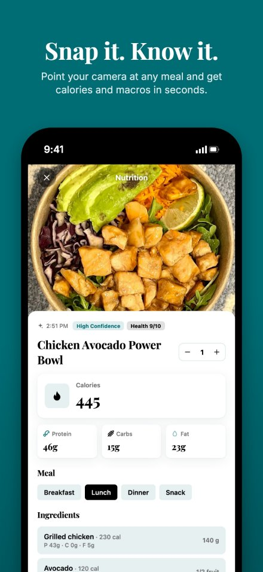
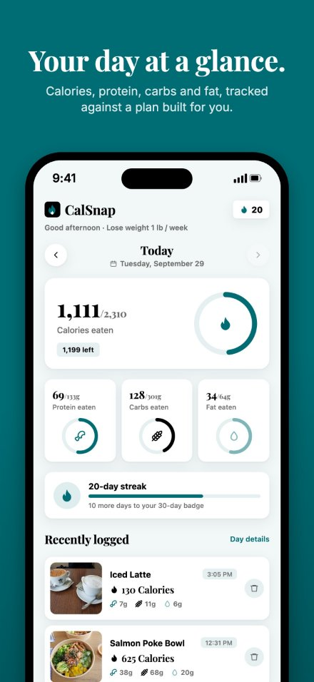
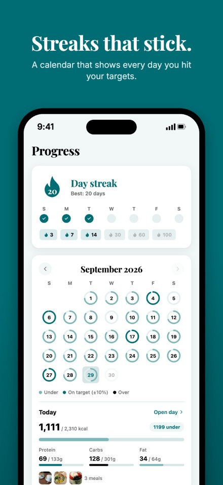
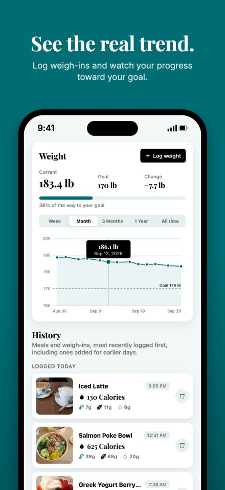
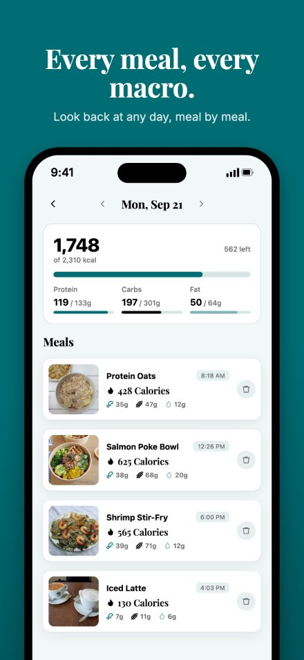
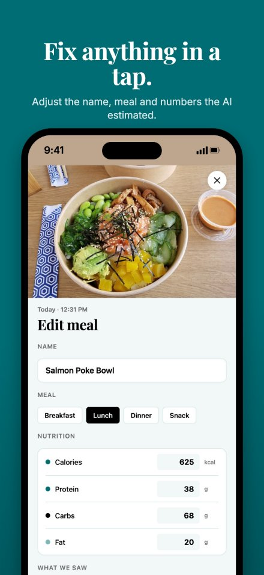
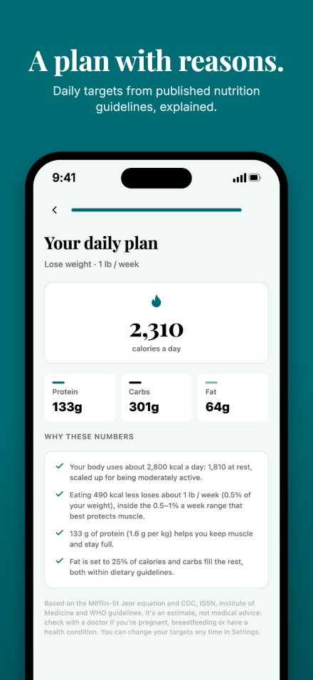

# CalSnap

Snap a photo of your meal and get calories and macros back in seconds. Built with Expo + React Native for iOS and Android, with Claude doing the food analysis.

## Screenshots

<p align="center">
  
  
  
  
</p>

<p align="center">
  
  
  
</p>

Full-size App Store sets: [iPhone 6.9"](docs/screenshots/app-store/iphone-6.9in) (1320×2868) and [iPad 13"](docs/screenshots/app-store/ipad-13in) (2064×2752). Screens use a seeded demo account; photo credits are in [CREDITS.md](docs/screenshots/CREDITS.md).

## Highlights

- **Photo to nutrition:** a vision model identifies each food, estimates portions and returns calories and macros as structured JSON, validated with Zod on the server and checked again in the app.
- **Personalised plan:** daily targets from the Mifflin-St Jeor equation and published CDC, ISSN and Institute of Medicine guidance, with the reasoning shown to the user.
- **Sync with an offline copy:** Supabase auth and Postgres, with row-level security so each user can only reach their own rows. Changes show instantly and save in the background; failed saves retry at next launch.
- **Security:** the AI key never ships in the app; the analysis server requires a signed-in user, rate-limits scans and validates uploads by their file signature.
- **Retention:** logging streaks with milestone badges, a goal-hit calendar, and reminders that skip meals you've already logged.

## Run it locally

You need Node 20+ and the **Expo Go** app on your phone (App Store / Play Store). An iOS Simulator or Android emulator also works, but they have no real camera, so use the library button there.

```bash
npm install
npm --prefix server install
```

**1. Connect Supabase** (accounts and data sync):

```bash
cp .env.example .env   # then fill in your project URL and publishable key
npx supabase login
npx supabase link --project-ref <your-project-ref>
npx supabase db push   # creates the tables and their row-level security policies
```

Only the publishable key goes in `.env`. Never put the secret or service-role key in the app.

**2. Start the AI server** (in its own terminal):

```bash
cp server/.env.example server/.env   # then paste your Anthropic API key into it
npm run server
```

No key yet? Run `npm run server:demo` instead. It returns a sample result for every photo so you can try the whole flow.

**3. Start the app:**

```bash
npx expo start
```

Scan the QR code with your phone's camera (iOS) or the Expo Go app (Android). Your phone must be on the **same Wi-Fi** as your laptop. The app finds the server automatically at `http://<your-laptop-ip>:8787`. If it can't, set the URL in **Settings → AI server** and tap **Test**.

## How it works

| Piece | Where |
|---|---|
| Screens (Home, Scan, Result, Progress, Settings) | `src/app/` (Expo Router) |
| Sign-in and data sync: meals, weigh-ins, goals, reminders | `src/lib/store.tsx`, `src/lib/sync.ts` (Supabase, with an offline copy on the device) |
| Database tables and row-level security | `supabase/migrations/` |
| Photo cleanup: resize to 1024px, JPEG, strips metadata | `src/lib/photo.ts` |
| Meal reminders + streak saver | `src/lib/notifications.ts` |
| AI analysis (Claude, structured JSON output) | `server/server.ts` |

The Anthropic API key lives only on the server, never inside the app. The server only analyzes photos for signed-in users (checked with Supabase) and limits each user to 30 scans an hour. Meal photos stay on the device that took them. For a production release, deploy `server/` somewhere public over HTTPS and point the app at it.

### Rewards and retention
- **Streak:** consecutive days with at least one logged meal. Badges at 3, 7, 14, 30, 60 and 100 days.
- **Goals:** calories count as hit within ±10% of your goal; each macro counts once you reach 90%. Logging a meal that crosses a goal triggers a celebration.
- **Reminders:** local notifications ask "Have you tracked breakfast/lunch/dinner?" and are skipped for meals you've already logged. A "streak ends at midnight" nudge fires in the evening if you haven't logged anything that day. Tapping a reminder opens the camera.

## Scripts

```bash
npm run server        # AI server (needs server/.env)
npm run server:demo   # AI server with sample results, no key needed
npx expo start        # app dev server
npm run typecheck
npm --prefix server run typecheck
npx expo lint
```
